# Procédure : Déploiement d'un poste client Windows 11 sur Proxmox VE

## Sommaire

1. [Création de la VM sur Proxmox](#i-création-de-la-vm-sur-proxmox)
   - [Paramètres Généraux](#1-paramètres-généraux)
   - [Système d'exploitation](#2-système-dexploitation)
   - [Configuration Système (Prérequis Windows 11)](#3-configuration-système-prérequis-windows-11)
   - [Ressources Matérielles](#4-ressources-matérielles)

2. [Installation du Système (Phase Windows Setup)](#ii-installation-du-système-phase-windows-setup)

3. [Configuration Personnalisée (OOBE & Bypass)](#iii-configuration-personnalisée-oobe--bypass)
   - [Configuration classique](#0-configuration-classique)
   - [Contournement du compte Microsoft](#1-contournement-du-compte-microsoft)
   - [Création du compte local](#2-création-du-compte-local)

4. [Finalisation](#iv-finalisation)

## I. Création de la VM sur Proxmox

### 1. Paramètres Généraux

-   **Nœud :** Sélectionnez votre serveur (ex: `nakserv`).
    
-   **ID / Nom :** Attribuez l'ID `100` et le nom `IT-DOC-Win11C`.
    
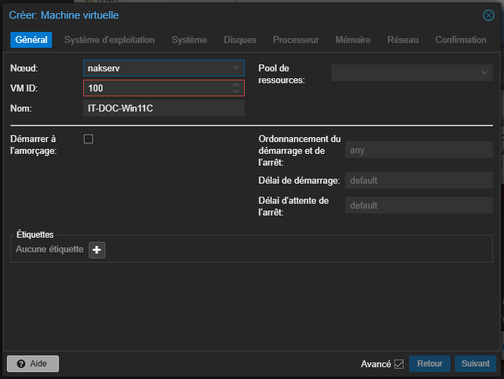

### 2. Système d'exploitation

-   **ISO :** Sélectionnez l'image `Win11_25H2_French` stockée sur votre serveur.
    
-   **Type/Version :** Choisissez `Microsoft Windows` et la version `11/2022/2025`.
    
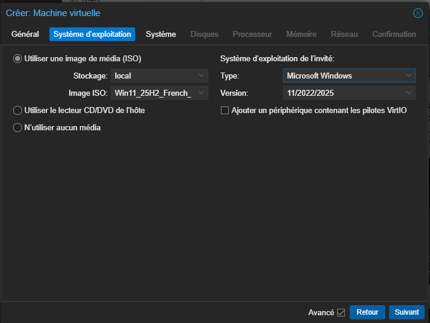

### 3. Configuration Système (Prérequis Windows 11)

-   **BIOS/Machine :** Utilisez `OVMF (UEFI)` et le chipset `q35`.
    
-   **Sécurité :** Cochez l'ajout d'un disque EFI et d'un module **TPM v2.0**.
    

> 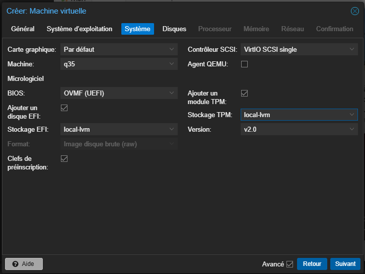

### 4. Ressources Matérielles

-   **Disque :** Allouez **60 Go** sur le stockage `local-lvm`.

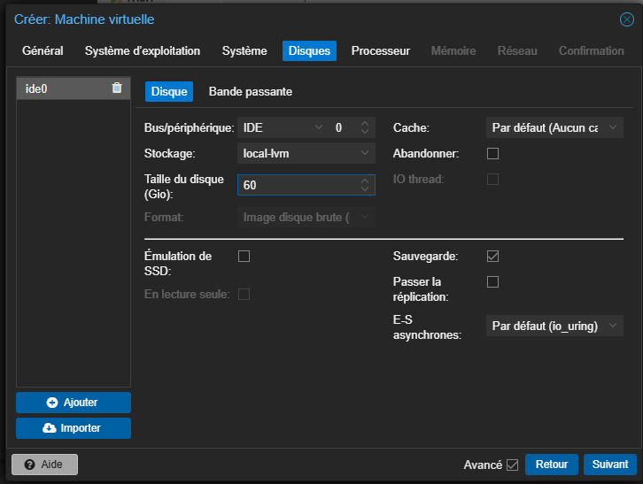
    
-   **CPU :** Configurez **2 cœurs**.

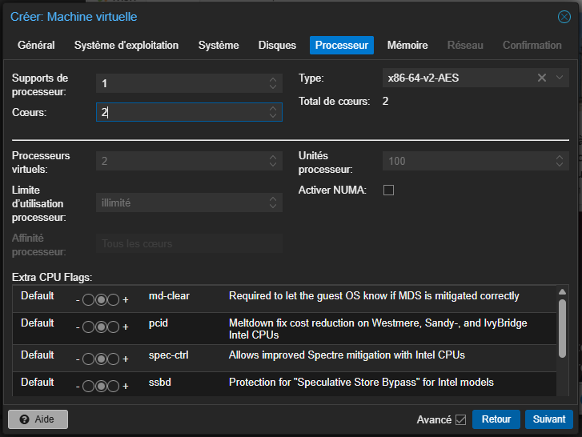
    
-   **RAM :** Allouez **4096 MiB** (4 Go) et désactivez le _ballooning_.

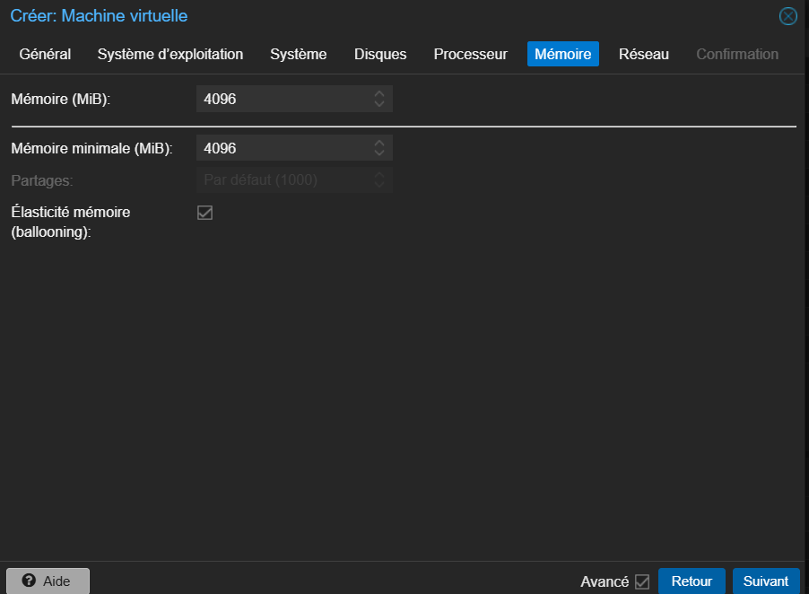
    
-   **Réseau :** Laissez les paramètres par défaut (Bridge `vmbr0`).

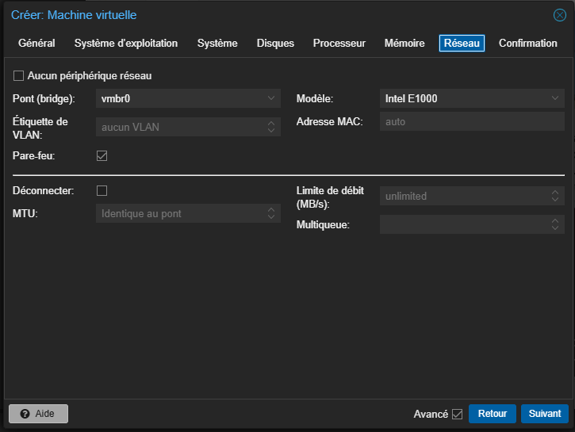
    

## II. Installation du Système (Phase Windows Setup)

1.  **Boot :** Lancez la VM et appuyez sur la barre espace pour démarrer 
l'installation.

 
2.  **Langue :** Validez le Français et le clavier AZERTY.

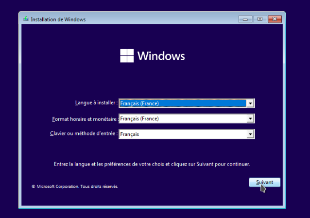   

3. **Clé Produit:** Si vous avez une clé produit, renseignez la sinon cliquez sur je n’ai pas de clé produit

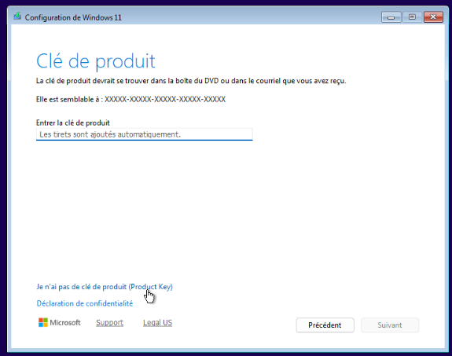   

    
4.  **Version :** Sélectionnez **Windows 11 Professionnel** pour plus de fonctionnalités .

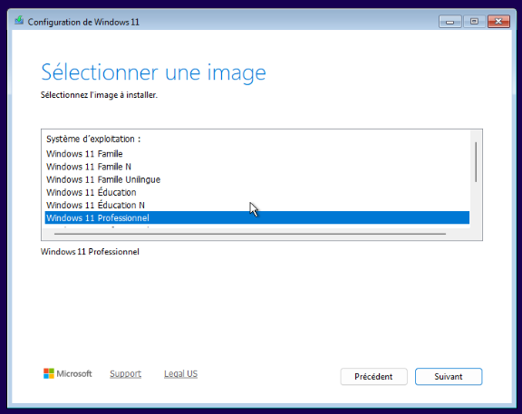   

5.  **Condition**:” Accepter les conditions

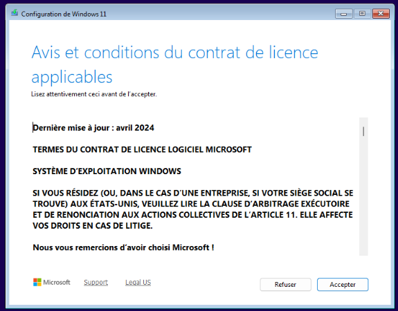   
    
6.  **Partitionnement :** Sélectionnez l'espace non alloué de 60 Go (noté 15 Go sur la capture d'exemple).

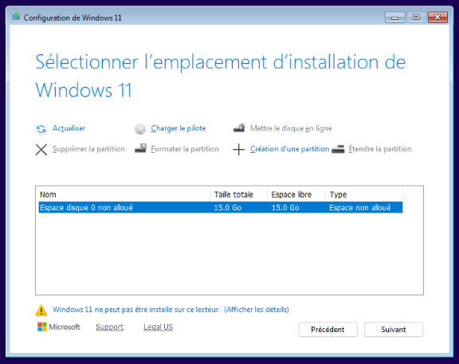   

7. **Finalisation:** Cliquez sur Installer

## III. Configuration Personnalisée (OOBE & Bypass)

### 0. Configuration classique

Sélectionnez la langue

   

Le clavier

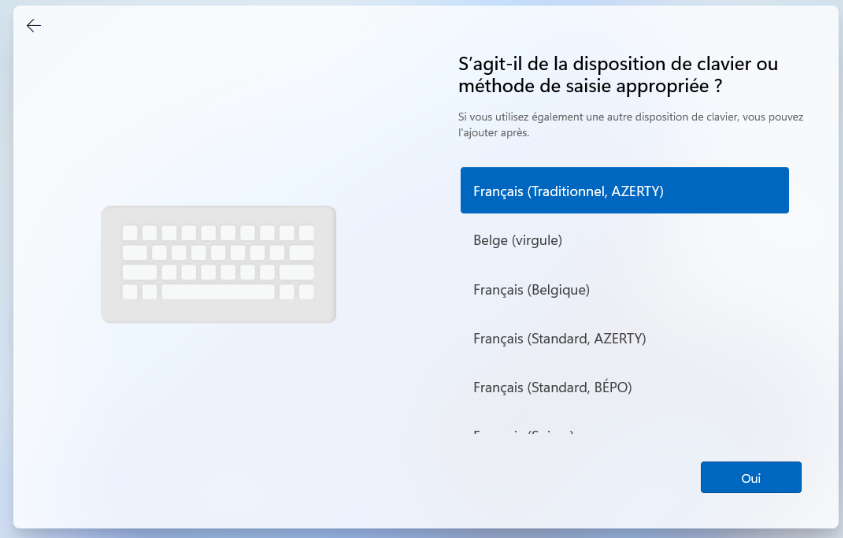   

Le type d’utilisation

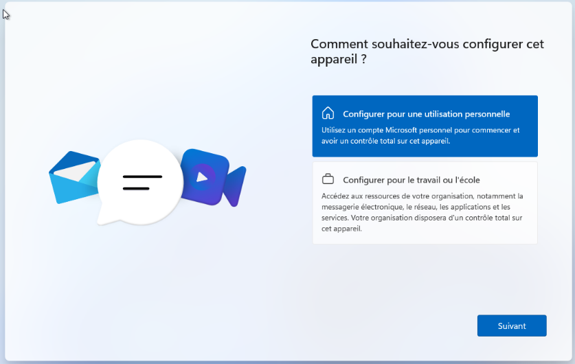   

### 1. Contournement du compte Microsoft

À l'écran de configuration du pays ou du réseau :

-   Ouvrez le terminal avec **Shift + F10** (ou Tab + F10).
  
    
-   Tapez la commande : `oobe\bypassnro`.

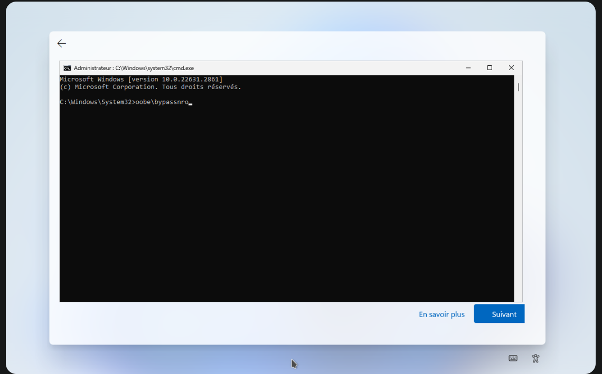   

    

### 2. Création du compte local

Windows va redémarrer et lorsque le boot est complet:

Vous allez de nouveau atterrir sur le choix du pays puis choix du clavier

Vous allez atterrir sur une page qui vous demande un nom pour cet appareil

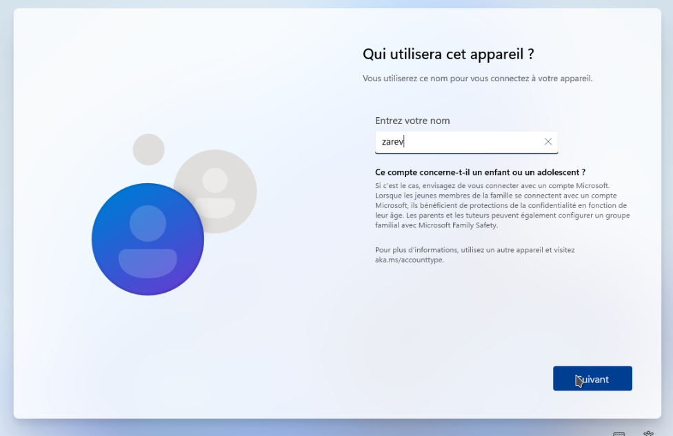   

    
Refusez systématiquement les options de collecte de données pour plus de confidentialité.
   

## IV. Finalisation

Patientez durant la préparation finale du bureau ("Bonjour", "Cette opération peut prendre quelques minutes").

   
   

Vous êtes enfin connecté sur votre machine windows 11

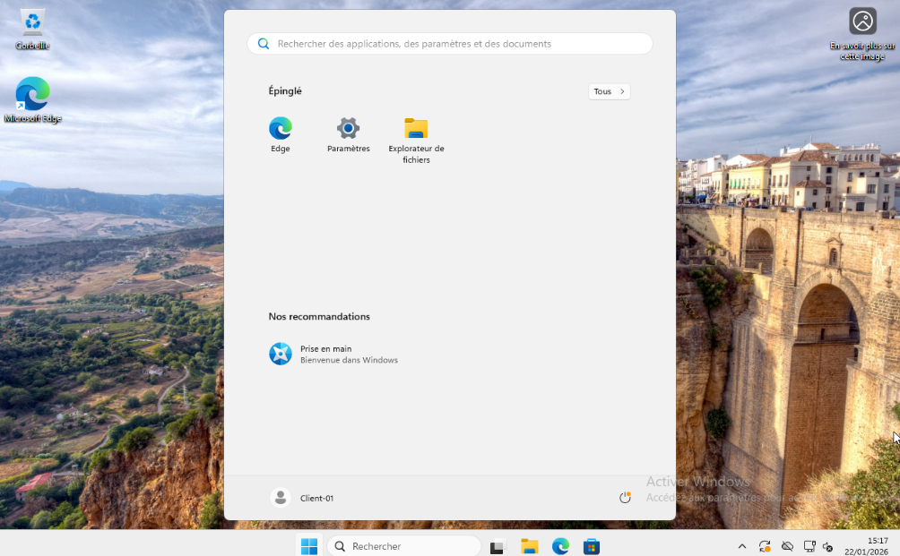   

